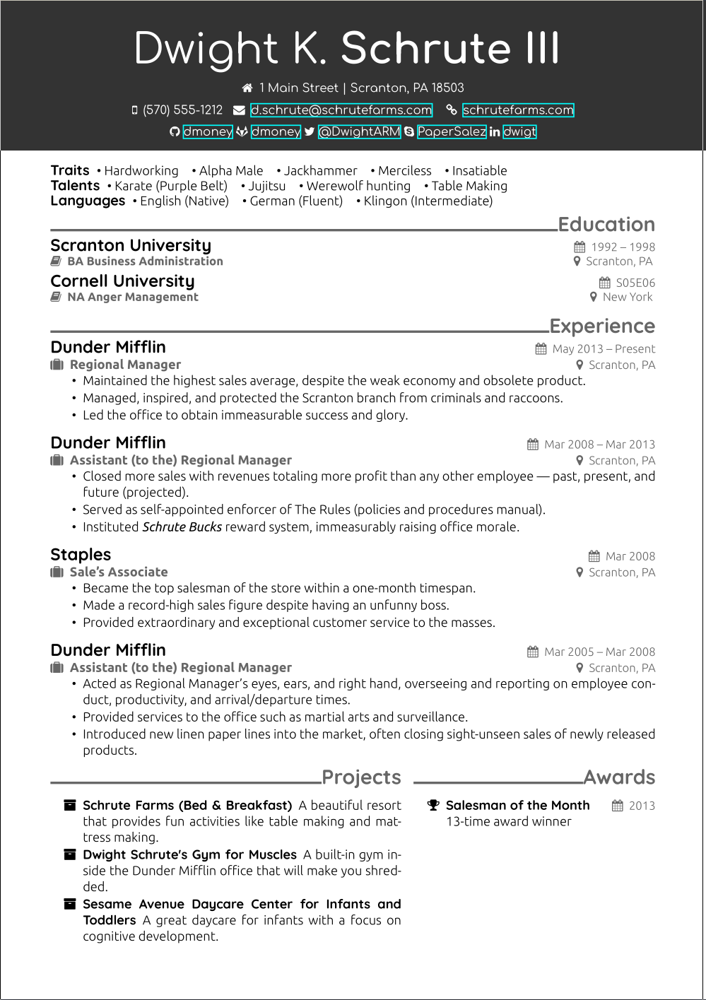
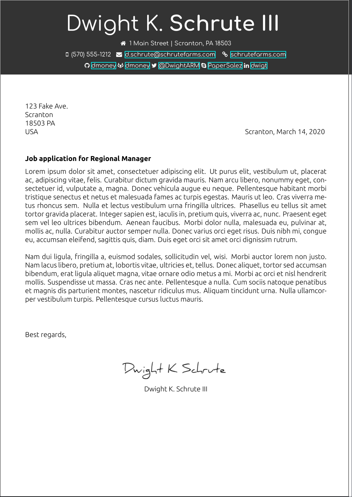

# Office Resume

This template is intended to be used as a single page resume.
I am sure you can make it work for multiple pages, however I have not tried that yet.

## Showcase
### Resume

### Cover Letter


## Requirements
* XeTeX
* latexmk
* _optional:_ make

## Build
This project can be build using either `make`, `latexmk` or
a LaTeX Docker image which includes XeTeX and `latexmk`.

### Make
```sh
make cover-letter
make resume

# make latexmk continuously build on change
make cont=true coverletter
make cont=true resume
```

### latexmk
```sh
latexmk -pdf -output-directory=out/ coverletter.tex
latexmk -pdf -output-directory=out/ resume.tex

# make latexmk continuously build on change
latexmk -pvc -output-directory=out/ coverletter.tex
latexmk -pvc -output-directory=out/ resume.tex
```

### Docker Build
Docker image: `lagerfeuer/xetexlive:latest`

```sh
docker run \
--rm -v $(pwd):/resume --workdir=/resume \
lagerfeuer/xetexlive-more:latest \
make coverletter resume
```

### All colors
To see all color options that are included by default, run
```sh
make allcolors
```
and open the files `out/resume-allcolors.pdf` and `out/coverletter-allcolors.pdf`.


## Changelog
### v1.0
Initial release (2020-03-14)
